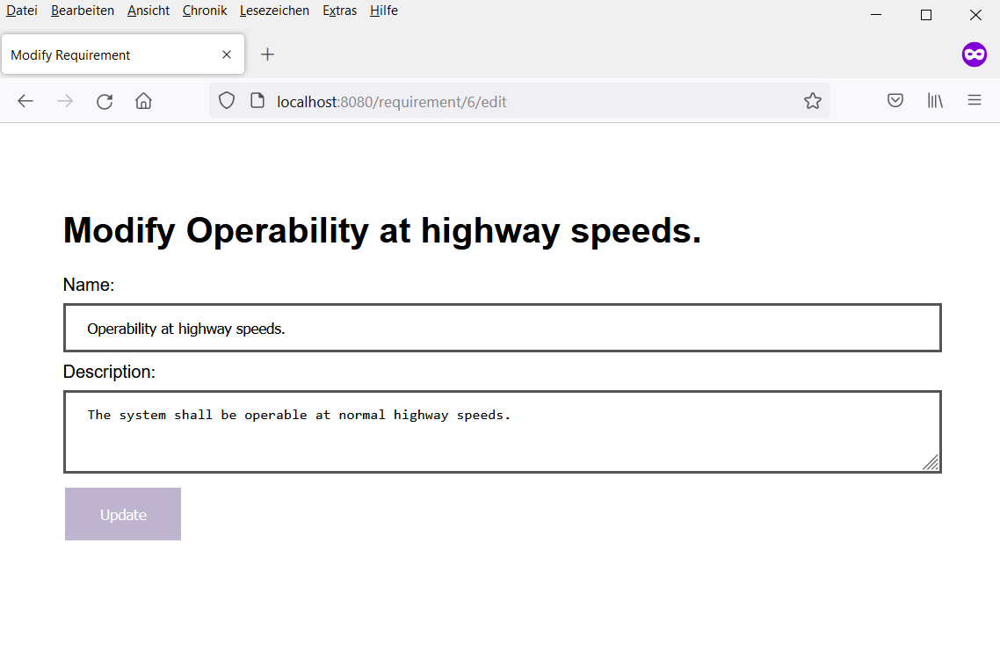

= Simple Requirements Management

This is a very simple requirements management application based on Spring Boot. It has been created for the purpose of teaching programming web applications using Spring MVC at https://www.hs-merseburg.de/[Merseburg University of Applied Sciences], Germany.

